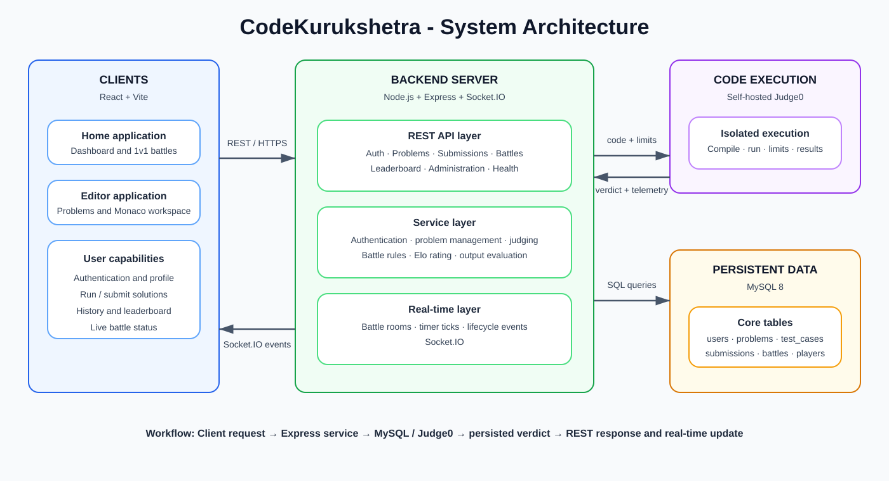

# CodeKurukshetra

CodeKurukshetra is a full-stack competitive-programming platform where users solve coding problems, run and submit solutions against test cases, review their history, and compete in real-time 1v1 coding battles.

Built with React, Node.js, Express, MySQL, Socket.IO, and self-hosted Judge0.

## Architecture



### Request and execution flow

1. A React client sends REST requests for authentication, problems, submissions, leaderboard data, and battle actions.
2. Express validates the request, applies authentication/rate limiting where required, and invokes the relevant service.
3. MySQL stores durable application data: users, problems, test cases, submissions, results, battles, and player state.
4. For a run or submission, the backend sends source code, language, stdin, CPU, wall-time, and memory limits to Judge0.
5. Judge0 compiles and executes code in its isolated execution environment. The backend polls for completion, normalizes output, evaluates each case, stores the result, and returns the verdict.
6. Socket.IO broadcasts battle lifecycle events and server-authoritative timer updates to connected battle rooms.

## Features

- Password and Google sign-in, signed sessions, profiles, and role-based admin routes
- Searchable problem catalogue with difficulty/tag filters, hints, editorials, votes, and comments
- Monaco-based editor with C++, Python, Java, and JavaScript support
- Public sample runs, hidden test-case submissions, custom test cases, and submission history
- Judge0-powered compilation/execution with output normalization and compile-error line remapping
- Real-time 1v1 battle rooms, matchmaking by topic, private room codes, timers, forfeits, and Elo-style ratings
- Problem administration and leaderboard APIs

## Technology stack

| Area | Technology |
| --- | --- |
| Client | React 19, Vite, Monaco Editor, Socket.IO Client |
| API | Node.js, Express 5, REST APIs, Socket.IO |
| Data | MySQL 8 with a connection pool |
| Code execution | Self-hosted Judge0, PostgreSQL, Redis, Docker |
| Security | scrypt password hashes, HMAC-signed tokens, CORS allowlist, security headers, rate limiting |

> This repository uses **MySQL**, not MongoDB. Its schema is in [backend/src/db/schema.sql](backend/src/db/schema.sql).

## Repository layout

```text
CodeKurukshetra/
├── backend/                 # Express API, MySQL services, Socket.IO and Judge0 integration
│   ├── src/controllers/     # HTTP request handlers
│   ├── src/routes/          # API route definitions
│   ├── src/services/        # Domain logic and external integrations
│   ├── src/db/              # Schema, migration, and seed scripts
│   └── problems/            # Problem metadata, wrapper config, and test cases
├── frontend/
│   ├── Home/                # Dashboard and 1v1 battle UI
│   └── Editor/              # Coding workspace UI
├── docs/                    # Documentation and diagrams
├── docker-compose.yml       # MySQL and self-hosted Judge0 stack
└── Dockerfile               # Backend production image
```

## Data model

The main persistent entities are:

- `users` - account details, role, profile fields, and battle rating
- `problems`, `problem_tags`, and `problem_constraints` - problem catalogue data
- `test_cases` - public and private input/output cases
- `submissions` and `submission_results` - source code, verdicts, and per-case execution data
- `battles` and `battle_players` - room metadata, participants, winner, and battle performance
- `battle_events` - extensible event/audit history for battles

The matchmaking queue is intentionally in memory for fast matching; completed battle information is persisted in MySQL.

## Local setup

### Prerequisites

- Node.js 20+
- Docker Desktop with Docker Compose
- MySQL 8, only when running the backend outside Docker

### Run the full backend and Judge0 stack

```bash
docker compose up -d --build
```

This starts MySQL, the backend on `http://localhost:3000`, Judge0 on `http://localhost:2358`, and Judge0's PostgreSQL/Redis dependencies. The backend runs its idempotent MySQL migration on startup.

Start either frontend separately:

```bash
cd frontend/Home
npm install
npm run dev
```

```bash
cd frontend/Editor
npm install
npm run dev
```

### Run the backend locally

Create `backend/.env`, ensure MySQL and Judge0 are available, then run:

```bash
cd backend
npm install
npm run db:migrate
npm run db:seed
npm run dev
```

## Environment variables

| Variable | Purpose | Default |
| --- | --- | --- |
| `PORT` | Backend HTTP/Socket.IO port | `3000` |
| `DB_HOST`, `DB_PORT`, `DB_USER`, `DB_PASSWORD`, `DB_NAME` | MySQL connection | local MySQL defaults |
| `AUTH_TOKEN_SECRET` | HMAC token-signing secret | development-only fallback |
| `CORS_ORIGINS` | Comma-separated frontend origins | local Vite ports |
| `GOOGLE_CLIENT_ID` | Enables Google ID-token verification | unset |
| `JUDGE0_API_URL` | Judge0 API base URL | `http://localhost:2358` |
| `JUDGE0_API_KEY` | Optional Judge0 API key | unset |
| `JUDGE0_POLL_INTERVAL_MS` | Judge0 polling interval | `100` |
| `JUDGE0_POLL_TIMEOUT_MS` | Judge0 polling timeout | `60000` |

Never commit real production secrets. In production, `AUTH_TOKEN_SECRET` must be explicitly configured and at least 32 characters long.

## API overview

| Area | Base route | Examples |
| --- | --- | --- |
| Authentication | `/auth` | sign up, sign in, current user, profile |
| Problems | `/problems` | list, details, sample cases, votes, comments |
| Submissions | `/submissions` | submit, custom run, history |
| Battles | `/battles` | topics, matchmaking queue, rooms, submit, forfeit |
| Leaderboard | `/leaderboard` | global ranking |
| Administration | `/admin` | create/update/deactivate problems and test cases |

`GET /health` checks both MySQL and a Judge0 execution round trip.

## Code execution lifecycle

`POST /submissions` stores the original source code as a pending submission. Function-style problems are wrapped with a language-specific driver; standard problems are sent unchanged. The Judge0 provider batches up to 20 cases and processes up to four batches concurrently. Results are mapped to Accepted, Wrong Answer, Time Limit Exceeded, Memory Limit Exceeded, Runtime Error, or Compilation Error. Only public case details are returned; hidden cases produce a summary.

## 1v1 battle lifecycle

1. An authenticated user joins a topic queue or creates a private room.
2. The service selects an active problem and records the battle/players in MySQL.
3. Players join the Socket.IO battle room and receive timer/status events.
4. Each battle submission uses the Judge0 execution path.
5. The winner is decided by first accepted solution; if needed, the service applies complexity/runtime tie-breakers or a draw.
6. The result is persisted and both player ratings are updated with Elo, using a K-factor of 32.

## Validation

```bash
cd backend
node --test tests/*.test.js

cd ../frontend/Home
npm run build

cd ../Editor
npm run build
```

For claims such as match count, test-case volume, or average execution latency, retain database queries, logs, or benchmark output and state the measurement conditions. Do not present unmeasured figures as production metrics.

## License

No license has been specified for this repository.
